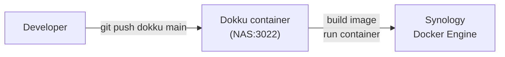
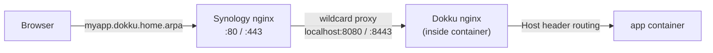

# dokku-synology

Run [Dokku](https://dokku.com) on a Synology NAS using Docker — `git push` deploys, automatic reverse proxy through DSM's native nginx.

## Assumptions

Before running the installer, make sure you have:

1. SSH enabled on the NAS (DSM → Control Panel → Terminal & SNMP)
2. `sudo` / root access on the NAS
3. Container Manager installed (DSM Package Center)
4. DNS Server installed (DSM Package Center) — the installer uses it to add the wildcard DNS entry

## What is Dokku?

Dokku is a self-hosted PaaS heavily influenced by Heroku. You write your app, push to Dokku, and it builds and runs it for you — no manual Docker commands needed.

Dokku supports:
- **Dockerfile** — if your repo has a `Dockerfile`, Dokku uses it
- **Procfile + buildpacks** — for Node, Python, Ruby, Go, etc.
- **Nixpacks / Railpack** — zero-config builds for common stacks

Your normal git workflow stays the same. You just add a second remote:

```bash
# Regular push to GitHub/GitLab — unchanged
git push origin main

# Push to your NAS to build and run
git push dokku main
```

Dokku acts as a git server. When you push, it kicks off a build, creates a Docker image, and runs your app as a container. See the [Dokku deployment docs](https://dokku.com/docs/deployment/application-deployment/#deploying-to-subdomains) for details on app setup, Procfiles, and environment config.

## Running Dokku commands

Since Dokku runs inside a Docker container on your NAS, prefix all Dokku commands with `docker exec dokku` (the repeated `dokku` is not a typo — one is the container name, one is the binary):

```bash
docker exec dokku dokku help
docker exec dokku dokku apps:list
docker exec dokku dokku logs <app>
docker exec dokku dokku config:set <app> KEY=value
docker exec dokku dokku ps:report <app>
```

## How it fits together on Synology





Dokku's internal nginx handles per-app routing by `Host:` header. DSM's nginx sits in front with a single wildcard rule — no per-app config needed anywhere in DSM.

## DNS & networking

The installer assumes you are running DNS on your network. By default it targets the zone `home.arpa`, giving every app a hostname of `<appname>.dokku.home.arpa`. To use a different zone pass `--zone`:

```bash
sudo bash /tmp/install.sh --zone example.local
```

The installer adds a wildcard A record to DSM bind9:

```
*.dokku.<zone>.    86400    IN    A    <nas-ip>
```

Your router also needs a DNS forward policy so that `*.dokku.<zone>` queries from LAN clients are sent to the NAS. The exact steps depend on your router firmware — look for "DNS forwarding" or "conditional forwarding" and point `dokku.<zone>` at the NAS IP.

Without router forwarding, only the NAS itself will resolve `*.dokku.<zone>`.

## TLS / HTTPS

The installer generates a **self-signed wildcard cert** for `*.dokku.<zone>`. This covers HTTP and HTTPS out of the box, but browsers will show a security warning.

To silence the warning, add the cert to your Mac's keychain:

```bash
scp root@<nas-ip>:/etc/nginx/dokku-wildcard.crt ~/dokku-wildcard.crt
sudo security add-trusted-cert -d -r trustRoot -k /Library/Keychains/System.keychain ~/dokku-wildcard.crt
```

For a browser-trusted wildcard cert without warnings you would need Let's Encrypt with a DNS-01 challenge (since `*.dokku.<zone>` is a private zone, HTTP-01 won't work). That is outside the scope of this installer.

## Install

Run on your NAS as root:

```bash
curl -fsSL https://raw.githubusercontent.com/pjaol/dokku-synology/main/install.sh -o /tmp/install.sh
sudo bash /tmp/install.sh
```

> Note: `bash <(curl ...)` process substitution is not supported on DSM's ash shell — download the script first.

The installer:
1. Clones this repo to `/var/lib/dokku-synology`
2. Starts the Dokku container (docker sock + named volume only)
3. Adds a `*.dokku.<zone>` wildcard A record to DSM bind9 and reloads named
4. Generates a self-signed wildcard TLS cert for `*.dokku.<zone>`
5. Writes `/etc/nginx/sites-enabled/dokku-wildcard.conf` and reloads DSM nginx

## Post-install

Add your SSH public key (run from your dev machine):

```bash
cat ~/.ssh/id_rsa.pub | ssh root@<nas-ip> 'docker exec -i dokku dokku ssh-keys:add admin'
```

## Deploy an app

```bash
git remote add dokku ssh://dokku@<nas-ip>:3022/<appname>
git push dokku main
```

App is available at:
- `http://<appname>.dokku.<zone>`
- `https://<appname>.dokku.<zone>` (self-signed cert — browser will warn unless trusted)

## Optional: synology-dns plugin

The `plugins/synology-dns` directory contains a Dokku plugin that automatically adds/removes per-app A records in DSM's bind9 zone file on deploy. Only needed if your router cannot forward wildcard DNS and you need explicit per-app records.

See [`plugins/synology-dns/README.md`](plugins/synology-dns/README.md) for setup.

## Tested on

- Synology DS920+ · DSM 7.2 · Intel Celeron J4125
- Dokku 0.37.10
