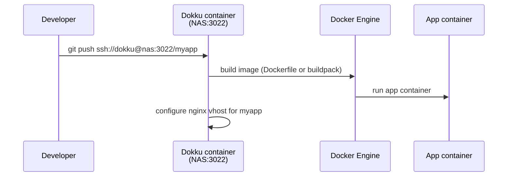
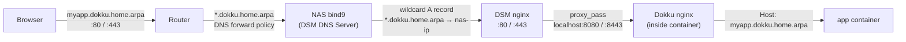

# dokku-synology

Run [Dokku](https://dokku.com) on a Synology NAS — `git push` deploys with automatic reverse proxy through DSM's native nginx.

## How it works

### Deploy flow



### Request routing



Key points:
- DSM nginx has **one static wildcard conf** routing `*.dokku.<zone>` → Dokku on ports 8080 (HTTP) and 8443 (HTTPS)
- Dokku's own nginx handles per-app routing by `Host:` header — no per-app DSM config needed
- A single `*.dokku.<zone>` wildcard DNS record covers all apps automatically

## Networking & DNS

This setup assumes you are running DNS in your network — either DSM DNS Server on the NAS, a Pi-hole, or similar. Without DNS, you will need to manually manage host entries for each app.

### Zone structure

The NAS runs bind9 (via DSM DNS Server) as the authoritative nameserver for your zone (default: `home.arpa`). A single wildcard A record covers all Dokku apps:

```
*.dokku.home.arpa.    86400    IN    A    <nas-ip>
```

The installer adds this record automatically if DSM DNS Server is detected.

### Router DNS forwarding

Your router needs a DNS forward policy so that `*.dokku.<zone>` queries are sent to the NAS rather than resolved upstream. The exact steps depend on your router firmware, but the policy should be:

| Domain | Forward to |
|--------|-----------|
| `dokku.<zone>` (or `*.dokku.<zone>`) | `<nas-ip>` |

Without this, clients on your LAN will not resolve `*.dokku.<zone>` even if the NAS bind9 has the record.

### Without DSM DNS Server

If you don't have DSM DNS Server installed, the installer skips the DNS step. You can handle resolution in any of these ways:

- Add a forward policy in your router pointing `*.dokku.<zone>` at the NAS IP
- Add a wildcard entry in Pi-hole or Adguard Home
- Manually add `/etc/hosts` entries per app on each client (not recommended)

### Port mapping

| Port | Service | Purpose |
|------|---------|---------|
| 3022 | Dokku SSH | `git push` deploys |
| 8080 | Dokku nginx (HTTP) | DSM nginx proxies `*.dokku.<zone>:80` here |
| 8443 | Dokku nginx (HTTPS) | DSM nginx proxies `*.dokku.<zone>:443` here |

## Requirements

- Synology DSM 7.x
- Container Manager installed
- `git` and `openssl` installed on the NAS (via Synology Package Center or Entware)
- DNS in your network (DSM DNS Server, Pi-hole, router, etc.)
- Router configured to forward `*.dokku.<zone>` queries to the NAS

## Install

Run on your NAS as root:

```bash
curl -fsSL https://raw.githubusercontent.com/pjaol/dokku-synology/main/install.sh -o /tmp/install.sh
sudo bash /tmp/install.sh
```

Default zone is `home.arpa`. To use a different zone:

```bash
sudo bash /tmp/install.sh --zone example.local
```

> Note: `bash <(curl ...)` process substitution is not supported on DSM's ash shell — download first.

The installer:
1. Clones this repo to `/var/lib/dokku-synology`
2. Starts the Dokku container (docker sock + named volume only)
3. If DSM DNS Server is installed: adds a `*.dokku.<zone>` wildcard A record and reloads named
4. Generates a self-signed wildcard TLS cert for `*.dokku.<zone>`
5. Writes `/etc/nginx/sites-enabled/dokku-wildcard.conf` (HTTP + HTTPS) and reloads DSM nginx

## Post-install

**Add your SSH public key** (run from your dev machine):
```bash
cat ~/.ssh/id_rsa.pub | ssh root@<nas-ip> 'docker exec -i dokku dokku ssh-keys:add admin'
```

## Deploy an app

```bash
git remote add dokku ssh://dokku@<nas-ip>:3022/<appname>
git push dokku main
```

App is available at:
- `http://<appname>.dokku.<zone>`
- `https://<appname>.dokku.<zone>` (self-signed cert — browser will warn)

## TLS certificates

The installer generates a self-signed wildcard cert valid for 10 years. Browsers will show a security warning unless you add the cert to your trusted store.

To add the cert to your Mac's keychain:
```bash
scp root@<nas-ip>:/etc/nginx/dokku-wildcard.crt ~/dokku-wildcard.crt
sudo security add-trusted-cert -d -r trustRoot -k /Library/Keychains/System.keychain ~/dokku-wildcard.crt
```

## Managing apps

```bash
docker exec dokku dokku apps:list
docker exec dokku dokku logs <app>
docker exec dokku dokku config:set <app> KEY=value
docker exec dokku dokku ps:report <app>
```

## Optional: synology-dns plugin

The `plugins/synology-dns` directory contains a Dokku plugin that automatically adds/removes DNS A records in DSM's bind9 zone file on deploy. This is only needed if your router cannot forward wildcard DNS for `*.dokku.<zone>` and you need per-app DNS records managed explicitly.

See [`plugins/synology-dns/README.md`](plugins/synology-dns/README.md) for setup instructions.

## Tested on

- Synology DS920+ · DSM 7.2 · Intel Celeron J4125
- Dokku 0.37.10
